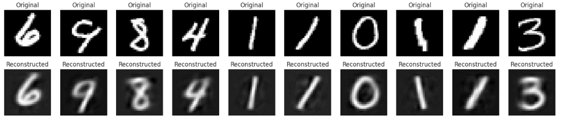
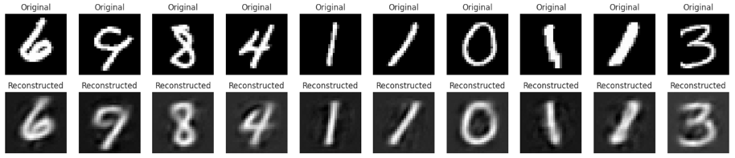
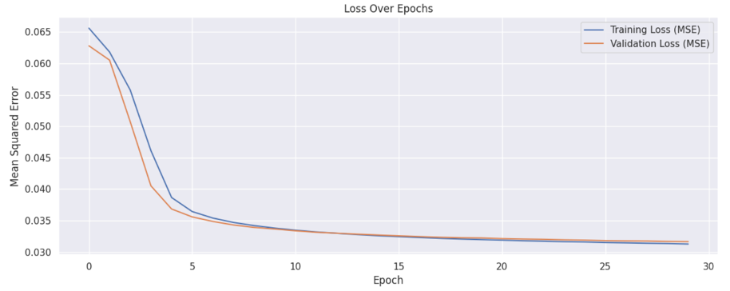
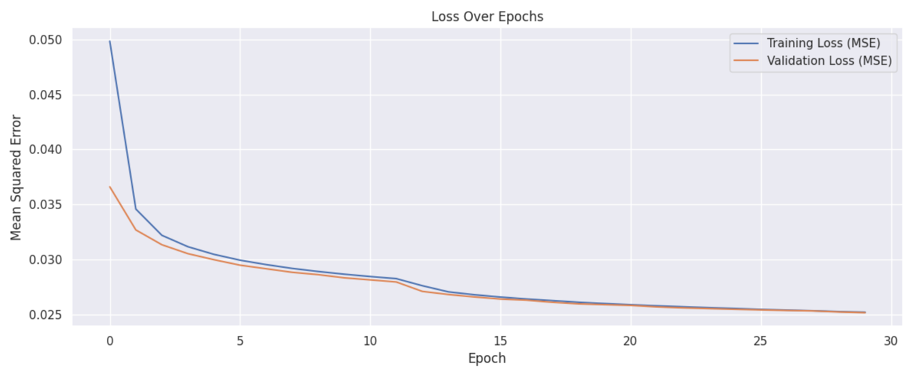
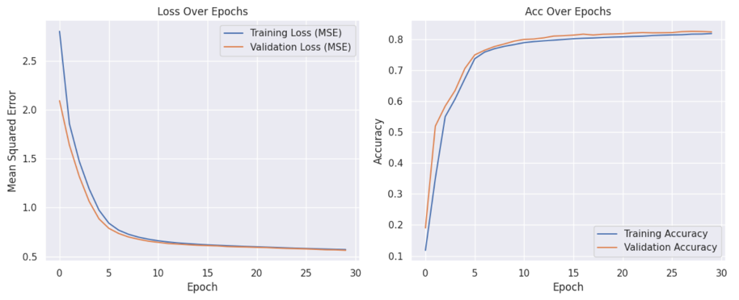
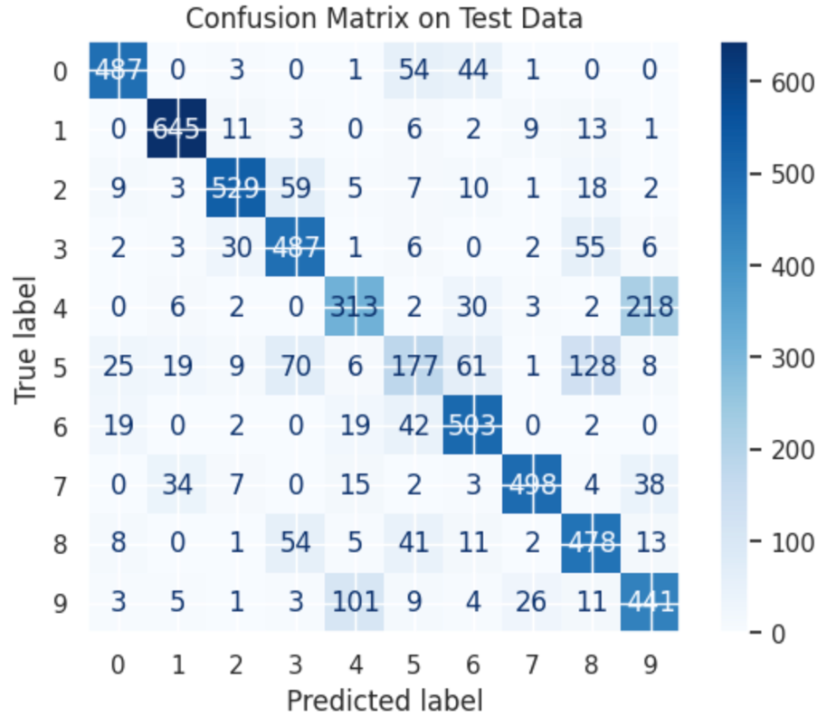
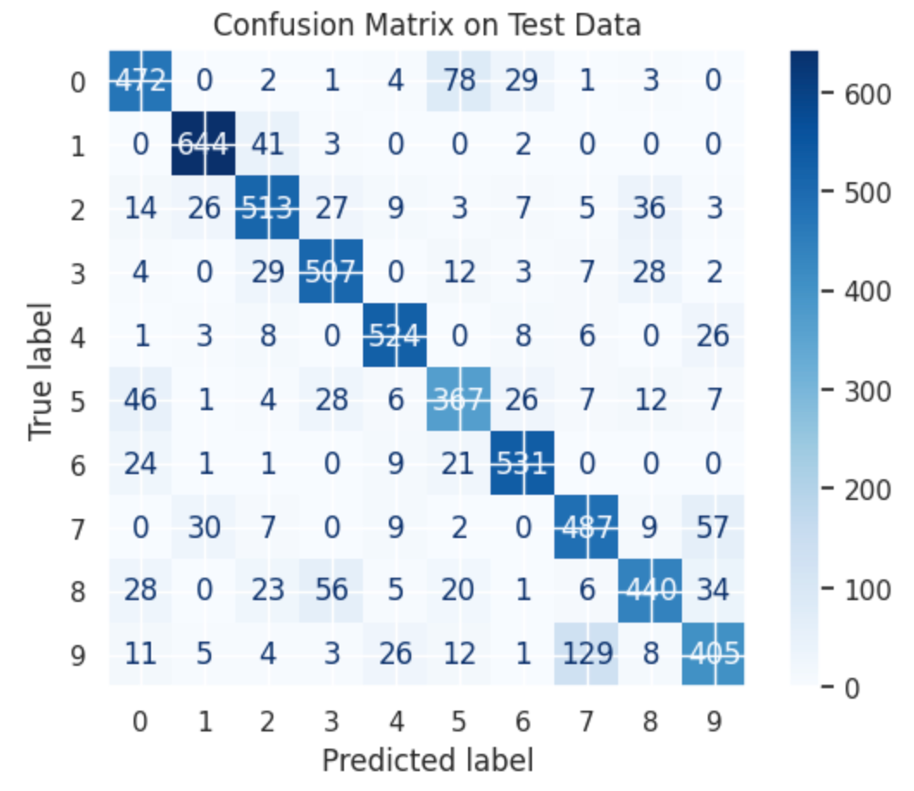

phase 1 : Train AutoEncoder for Different latent sizes and evaluate loss

size latent hidden layer = 4 

size latent hidden layer = 8

size latent hidden layer = 4 

size latent hidden layer = 8 

size latent hidden layer = 8 

phase 2 : classify(using MLP) MNIST Dataset Using Frozen Encoder 

size latent hidden layer = 4 

size latent hidden layer = 8 

